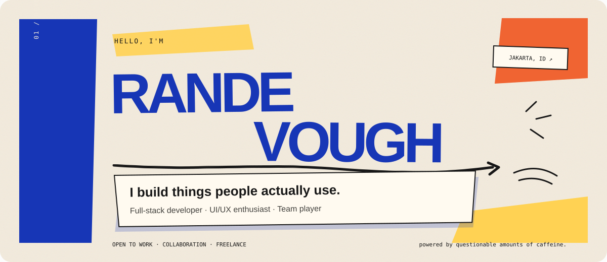
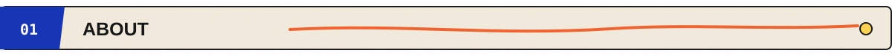
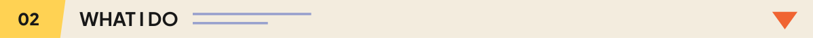
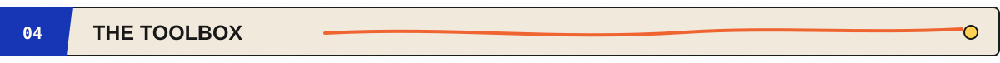
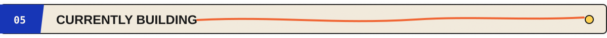
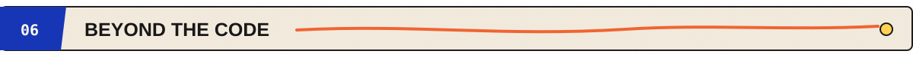
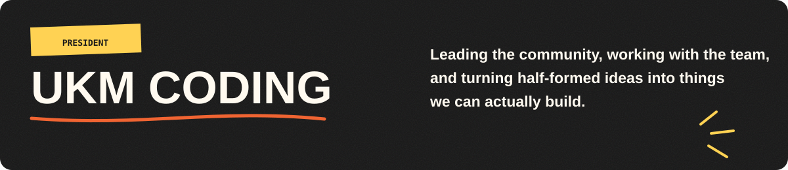
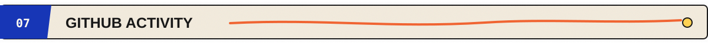
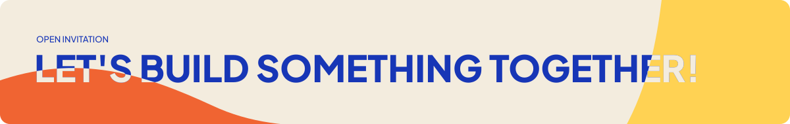

  

  <strong>Open to work · collaboration · freelance</strong> 
  <a href="#">Portfolio</a> ·
  <a href="#">LinkedIn</a> ·
  <a href="mailto:your@email.com">Email</a> ·
  <a href="https://github.com/Randevough">GitHub</a>

I'm a developer who enjoys turning ideas into things that actually work.

I like building full-stack applications, designing interfaces that feel good to use, and working with people to turn messy ideas into something we can actually ship.

I care about three things:

<table>
<tr>
<td width="33%" valign="top">

**BUILDING THINGS**

From the first idea to the last `git push`.

</td>
<td width="33%" valign="top">

**MAKING THINGS FEEL RIGHT**

Because functional doesn't have to mean ugly.

</td>
<td width="33%" valign="top">

**MAKING THINGS HAPPEN**

Good ideas are better when there's a team willing to build them.

</td>
</tr>
</table>

<table>
<tr>
<td width="18%"><strong>BUILD</strong></td>
<td>Full-stack web applications, digital products, and experiments that start with <em>“what if...”</em></td>
</tr>
<tr>
<td><strong>DESIGN</strong></td>
<td>UI/UX with a soft spot for clean interfaces, thoughtful interactions, and things that don't make users question their life choices.</td>
</tr>
<tr>
<td><strong>LEAD</strong></td>
<td>Working with people, organizing ideas, and turning <em>“we should probably do this”</em> into <em>“it's live.”</em></td>
</tr>
</table>

A few things I've built, broken, rebuilt, and eventually shipped.

<table>
<tr>
<td width="50%" valign="top">

### 01 — PROJECT NAME

A short description of what it does, who it helps, and why it exists.

`Tech` · `Tech` · `Tech`

[View project ↗](#)

</td>
<td width="50%" valign="top">

### 02 — PROJECT NAME

A short description of what it does, who it helps, and why it exists.

`Tech` · `Tech` · `Tech`

[View project ↗](#)

</td>
</tr>
<tr>
<td width="50%" valign="top">

### 03 — PROJECT NAME

A short description of what it does, who it helps, and why it exists.

`Tech` · `Tech` · `Tech`

[View project ↗](#)

</td>
<td width="50%" valign="top">

### 04 — PROJECT NAME

A short description of what it does, who it helps, and why it exists.

`Tech` · `Tech` · `Tech`

[View project ↗](#)

</td>
</tr>
</table>

  
  
  
  
  
  
  
  
  
  
  

<table>
<tr>
<td width="65%" valign="top">

I'm currently building full-stack applications, digital products, and small experiments—usually starting with a messy idea and ending somewhere between *“it works”* and *“we should probably refactor that.”*

</td>
<td width="35%" valign="top">

**CURRENT FOCUS**

- Reliable products
- Thoughtful interfaces
- Shipping more often

</td>
</tr>
</table>

  

Because software is rarely just about the code. It's also about communicating clearly, working through uncertainty, and keeping everyone moving in the same direction.

Still figuring out the deadline part.

<table>
<tr>
<td width="50%" align="center">
  
</td>
<td width="50%" align="center">
  
</td>
</tr>
</table>

### A YEAR OF BUILDING THINGS

My GitHub activity, visualized in a slightly more interesting way than a collection of green squares.

<picture>
  <source media="(prefers-color-scheme: dark)" srcset="https://raw.githubusercontent.com/Randevough/randevough/output/galaga-contribution-graph-dark.svg" />
  <source media="(prefers-color-scheme: light)" srcset="https://raw.githubusercontent.com/Randevough/randevough/output/galaga-contribution-graph.svg" />
  
</picture>

 

  

  Got an idea, a project, or just an unnecessarily complicated problem?

  I'm always interested in building interesting things.

  **[Portfolio](#) · [LinkedIn](#) · [Email](mailto:your@email.com) · [GitHub](https://github.com/Randevough)**

   

  `Randevough / building things since forever · made with questionable amounts of caffeine.`

