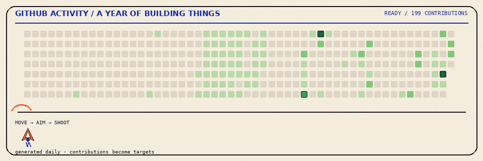

  

 

## 01 / ABOUT

I'm a developer who enjoys turning ideas into things that actually work.

I like building full-stack applications, designing interfaces that feel good to use, and working with people to turn messy ideas into something we can actually ship.

I care about three things:

**Building things.**  
From the first idea to the last `git push`.

**Making things feel right.**  
Because functional doesn't have to mean ugly.

**Making things happen.**  
Good ideas are better when there's a team willing to build them.

---

## 02 / WHAT I DO

<table>
<tr>
<td width="33%" valign="top">

### BUILD

Full-stack web applications, digital products, and experiments that start with *“what if...”*

</td>
<td width="33%" valign="top">

### DESIGN

UI/UX with a soft spot for clean interfaces, thoughtful interactions, and things that don't make users question their life choices.

</td>
<td width="33%" valign="top">

### LEAD

Working with people, organizing ideas, and turning *“we should probably do this”* into *“it's live.”*

</td>
</tr>
</table>

---

## 03 / SELECTED WORK

A few things I've built, broken, rebuilt, and eventually shipped.

<table>
<tr>
<td width="50%" valign="top">

### PROJECT 01

**Project Name**

A short description of what it does, who it helps, and why it exists.

`Tech` · `Tech` · `Tech`

[→ View project](#)

</td>
<td width="50%" valign="top">

### PROJECT 02

**Project Name**

A short description of what it does, who it helps, and why it exists.

`Tech` · `Tech` · `Tech`

[→ View project](#)

</td>
</tr>
<tr>
<td width="50%" valign="top">

### PROJECT 03

**Project Name**

A short description of what it does, who it helps, and why it exists.

`Tech` · `Tech` · `Tech`

[→ View project](#)

</td>
<td width="50%" valign="top">

### PROJECT 04

**Project Name**

A short description of what it does, who it helps, and why it exists.

`Tech` · `Tech` · `Tech`

[→ View project](#)

</td>
</tr>
</table>

---

## 04 / THE TOOLBOX

**Frontend**  
React · Next.js · Tailwind CSS · HTML · CSS

**Backend**  
Node.js · Express · MongoDB

**Languages**  
JavaScript · TypeScript · Python

**Design**  
Figma · UI/UX

**Tools**  
Git · GitHub · VS Code

---

## 05 / CURRENTLY BUILDING

I'm currently building full-stack applications, digital products, and small experiments—usually starting with a messy idea and ending somewhere between *“it works”* and *“we should probably refactor that.”*

Right now, I'm focused on making products more reliable, interfaces more thoughtful, and shipping more often.

---

## 06 / GITHUB ACTIVITY

### A YEAR OF BUILDING THINGS

My GitHub activity, visualized in a slightly more interesting way than a collection of green squares.

  

---

## 07 / BEYOND THE CODE

As President of **UKM Coding**, I lead the community, work with the team, and help turn half-formed ideas into things we can actually build.

Because software is rarely just about the code. It's also about communicating clearly, working through uncertainty, and keeping everyone moving in the same direction.

Still figuring out the deadline part.

---

## LET'S BUILD SOMETHING

Got an idea, a project, or just an unnecessarily complicated problem?

I'm always interested in building interesting things.

**Open to work · collaboration · freelance**

[Portfolio](#) · [LinkedIn](#) · [Email](mailto:your@email.com) · [GitHub](https://github.com/Randevough)

 

`Randevough / building things since forever · made with questionable amounts of caffeine.`

